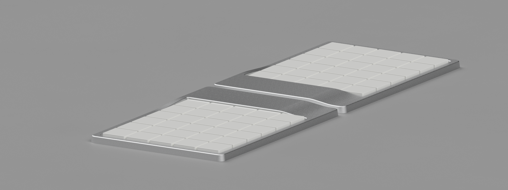

import { GridParent } from "@/components";
import { Text, Heading, Box, Paragraph } from "theme-ui";
import { Img } from "../Img";

export const metadata = {
  title: "Design Systems and Brand Identity",
  description: "Exploring the relationship between design systems and brand identity",
  publishDate: "2023-06-22",
  author: "Sebastian Graz",
  featured: false,
};

export default () => {
  return (
    <GridParent
      sx={{
        mx: "auto",
        py: [5, 6],
      }}
    >
      <Box sx={{ gridColumn: ["2/span 8", "2 / span 8"] }}>
        <Heading as="h1" sx={{ fontSize: [5, 6], mb: 4 }}>
          {metadata.title}
        </Heading>
        <Text
          variant="label"
          sx={{
            color: "textDim",
            mb: 5,
          }}
        >
          Published on {new Date(metadata.publishDate).toLocaleDateString()}
        </Text>
      </Box>

      <Box sx={{ gridColumn: ["2/span 8", "2 / span 8"] }}>
        <Paragraph>
          Design systems are more than just a collection of components and guidelines. They are the visual language that
          communicates your brand's personality, values, and mission.
        </Paragraph>
        <Paragraph>
          When crafted thoughtfully, a design system becomes the backbone of brand consistency across all touchpoints,
          from digital products to marketing materials and beyond.
        </Paragraph>
      </Box>
      <Box sx={{ gridColumn: ["2/span 8", "2 / span 8"] }}>
        
      </Box>
    </GridParent>

);
};
