import { EmailLink } from "@/components/EmailLink/EmailLink";
import { Faq, Question, Answer } from "@/pages/articles/FAQ";

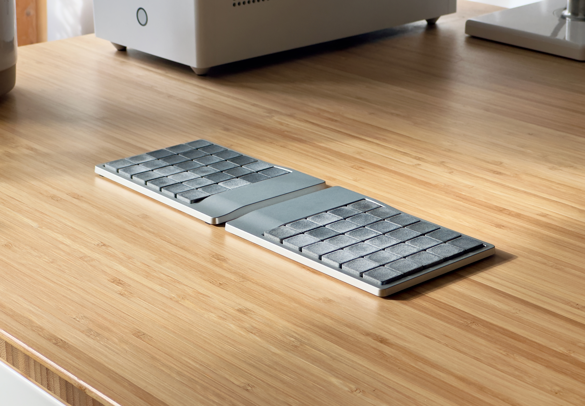

# I built a keyboard

- Wireless split
- 60% ortholinear layout
- PG1316S switches
- MFJ printed custom keycaps
- CNC machined 7075 aluminum enclosure
- Custom white PCB
- Dimensions W139 · L93 · H5
- Weight 180g
- ZMK Studio
- 3 months to build
- Material cost per set ~$313

# Motivation

I love the rawness of custom built ergo keyboards. But for my first serious custom build I wanted to achieve a more commercial look and finish. Since I had no CAD experience, it was also an excellent chance to learn hardware design, electronics and million of other skills I never thought I'd need to know.

The name <mark>Bayleaf</mark> is inspired by <mark>Lauriergracht</mark>, the street where our co-working office is located in Amsterdam.

# Design decisions

- <mark>Wireless</mark> — non-negotiable, especially with splits. I'm not dealing with any cables. Removing my right
  side to make space for mouse movements while gaming still feels magical.
- <mark>Ortholinear</mark> — is what I'm used to, my two previous keyboards were ortho. And I've gotten pretty
  proficient with them.
- <mark>Sans stagger</mark> — I'm not against stagger, I just love the neat look of a pain grid. Lack of stagger also
  makes it easier to work with on a hardware level.
- <mark>Layout</mark> — a larger 60% layout was a deliberate choice to avoid context switching as I often swap between
  my Macbook and desktop. I also went with a 17x17mm switch spacing.
- <mark>Ergonomics</mark> — not gonna lie this is a planned form-over-function kind of deal.
- <mark>Aluminum</mark> — for aesthetics and to get that finished commercial look. Sacrificing RF signal, potential ESD
  issues I was cool with.

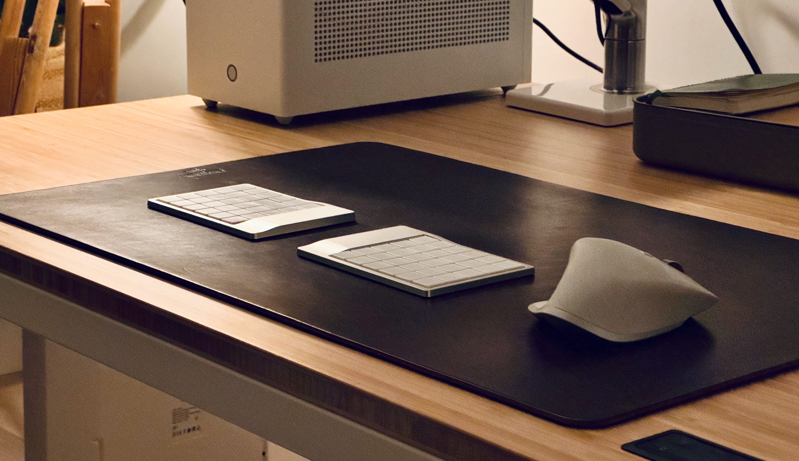
<aside>Tallest part of the keyboard is only 5mm</aside>

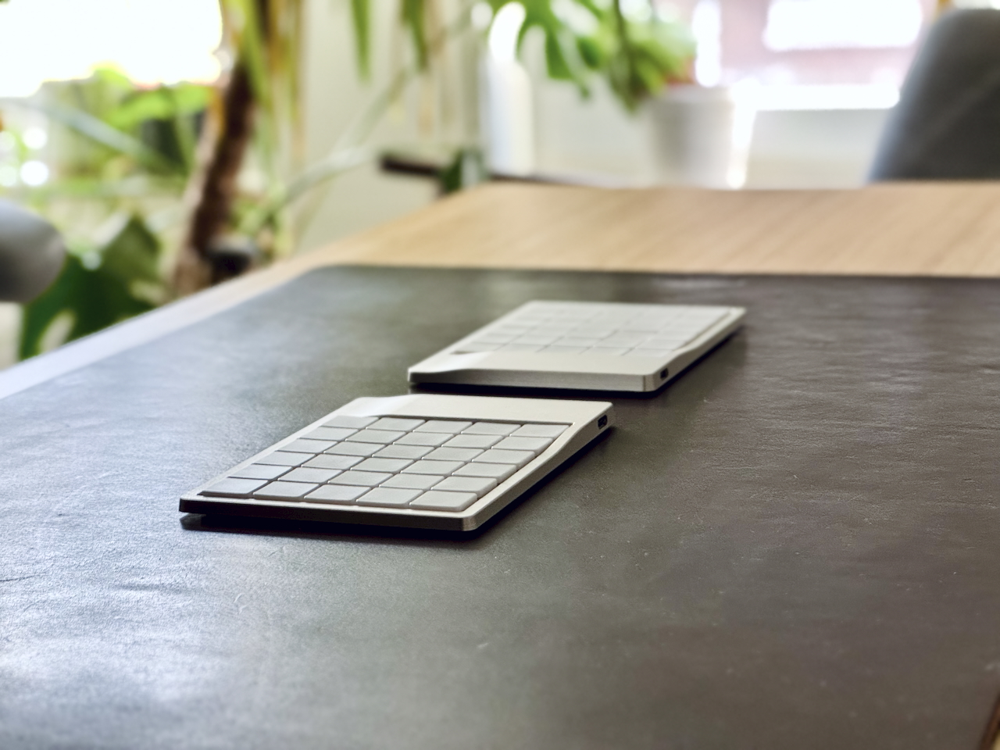

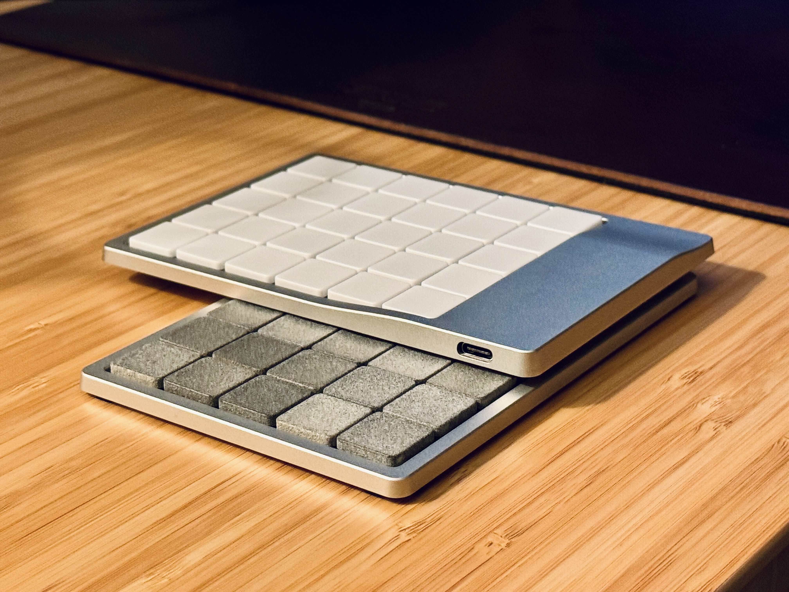
<aside>Two different keycap variations. White ones are stock, grey ones are custom printed MJF caps.</aside>

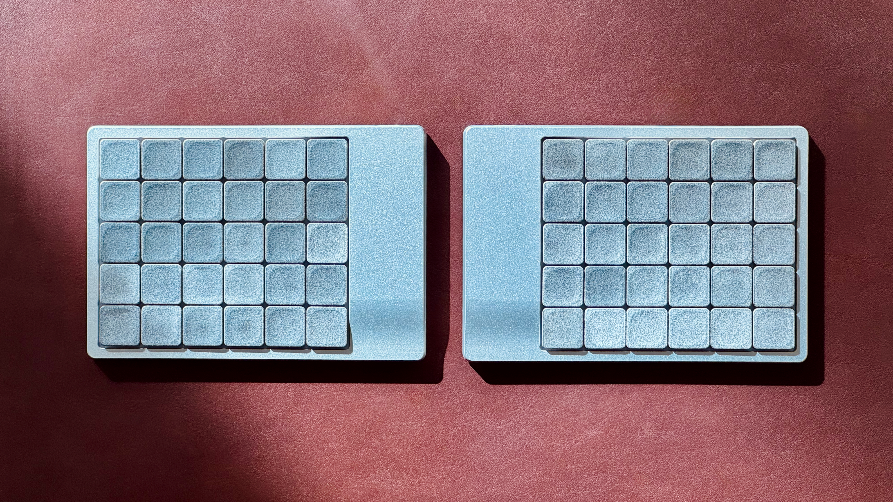

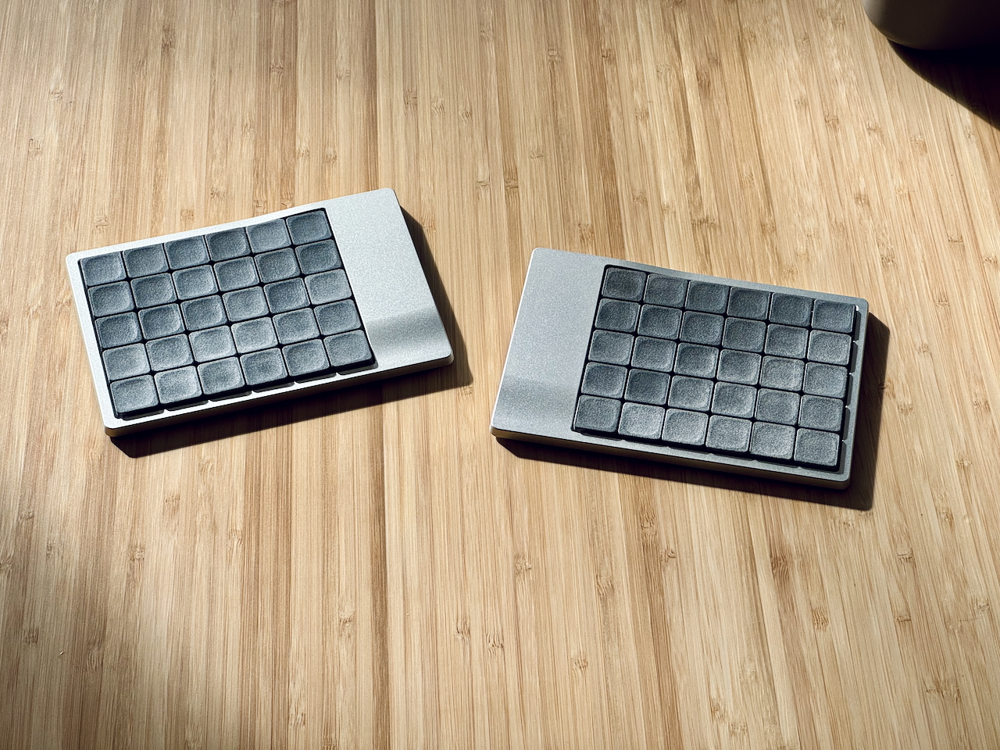
<aside>The variation in the gray color is a side effect of SLS/MJFs sintering process. No impact on tolerances.</aside>

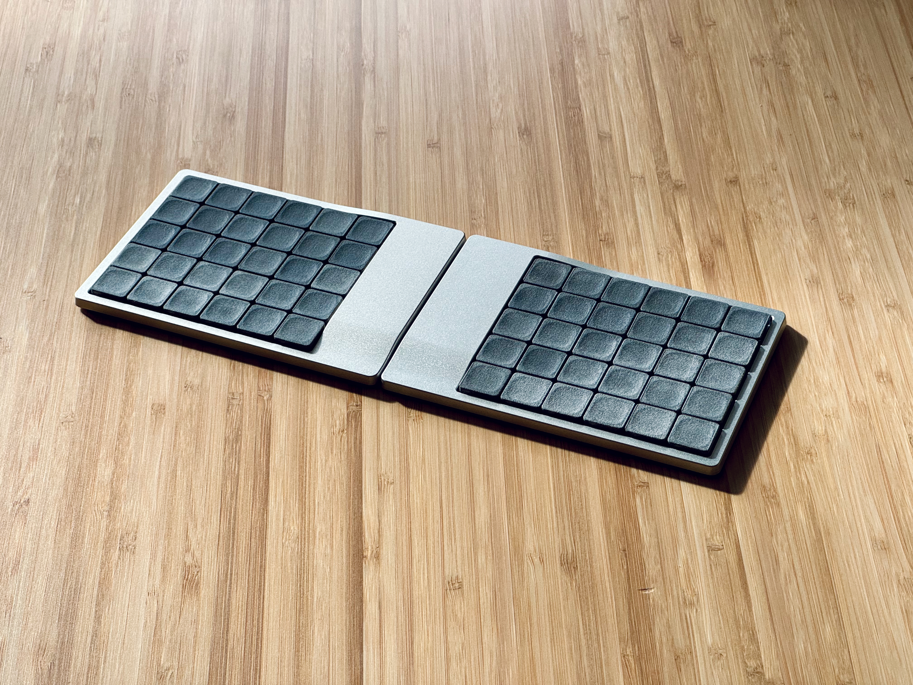

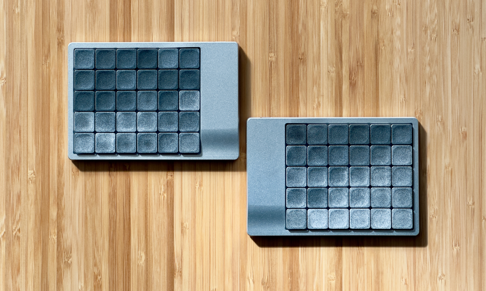
<aside>Custom printed MJF caps, sorted by how "baked" each cap was starting from darkest to lightest.</aside>

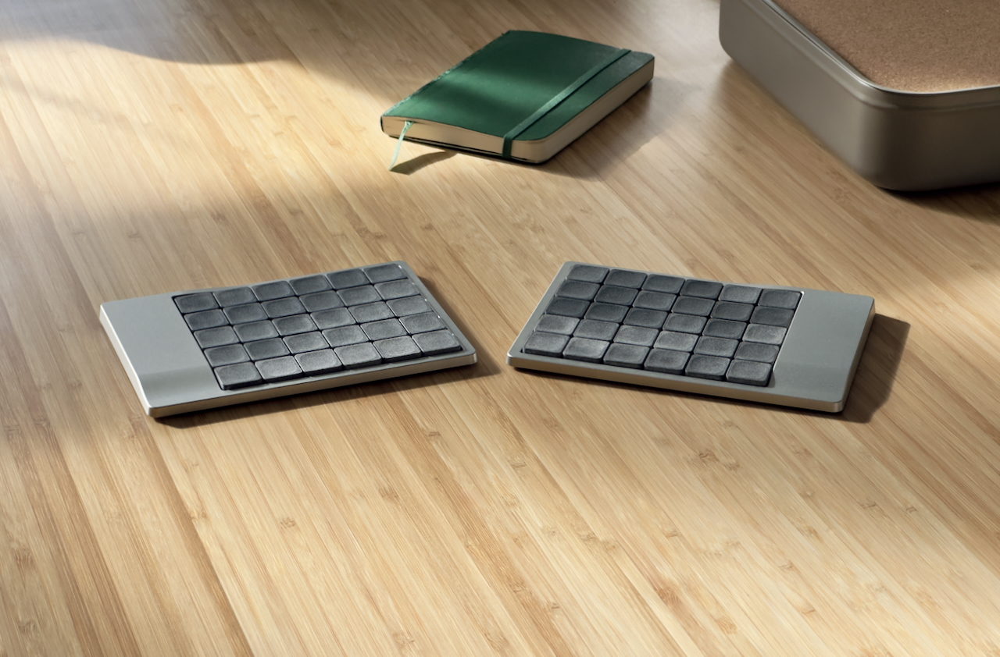

# Build log

When Mikefive posted his keyboard on Reddit I found myself uncontrollably nodding along. He showed the world that it's possible to build ergo keyboards that are stylish, low-profile and accessible for hobbyist.

At the very least he validated for me that building a keyboard of that caliber is doable. The decision to commit time and resources became easier to make. And off I went.

The opening bell for this project was sketching. These 2D sketches were made many months prior, but I was able to repurpose them to validate how the components would sit within the enclosure with the new ideas I had.

<aside>I knew these design wouldn't be final so I didn't scrutinize over dimensions at this point.</aside>

Then came the schematics. Electronic schematics very scary. Scary because I didn't know the level of skill required of me to design one. This could have easily been the point where I succumb to procrastination hell. Luckily with the help of youtube tutorials & various builder communities I managed to produce a working schema.

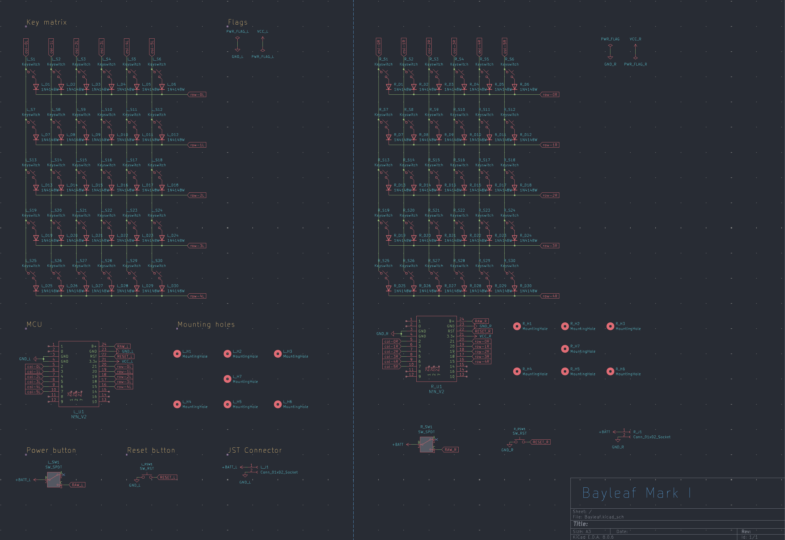

After the schematics I admiteddly had a lot of fun designing the PCB layout. I landed on separating the sides by V-cuts, which lets me snap the PCBs apart by hand. Combining the sides also kept my files tidy and a little cheaper to manufacture.

The actual logic was built around a nice!nano microcontroller. This controller has all the spicy stuff like power management and antennas already build in. This allowed me to keep things simple, no extra LEDs, no screens, no rotary encoders. Just the bare minimum for power and communication.

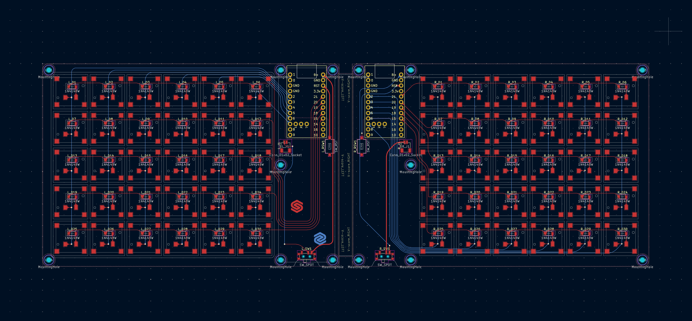

Designing the aluminum enclosure was another curveball. It was the first time I worked with a parametric design software with required some level of brain rewiring. Early on I had discarded tons of near finished files because they'd break randomly when tweaking the dimensions, simply because the order of the changes I made were incorrect.

I counted about 100 versions of the case before I settled for this final version. That said it was incredibly motivating to model stuff you know will exist in the physical world soon.

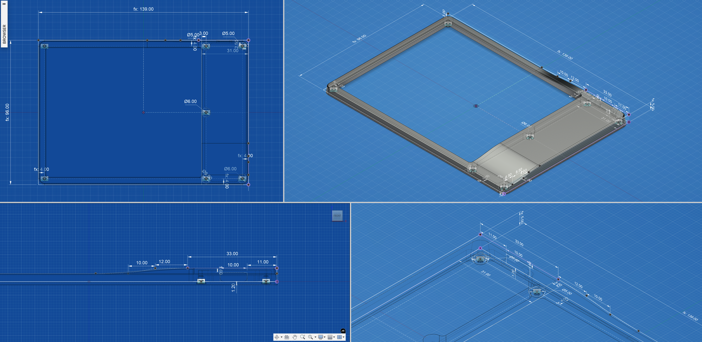

I realized I needed optimize for CNC-machining. Which meant removing any enclosed overhangs, or features that a drill can't reach physically. And of course removing any sharp corners that can't be cut by a round drill bit.

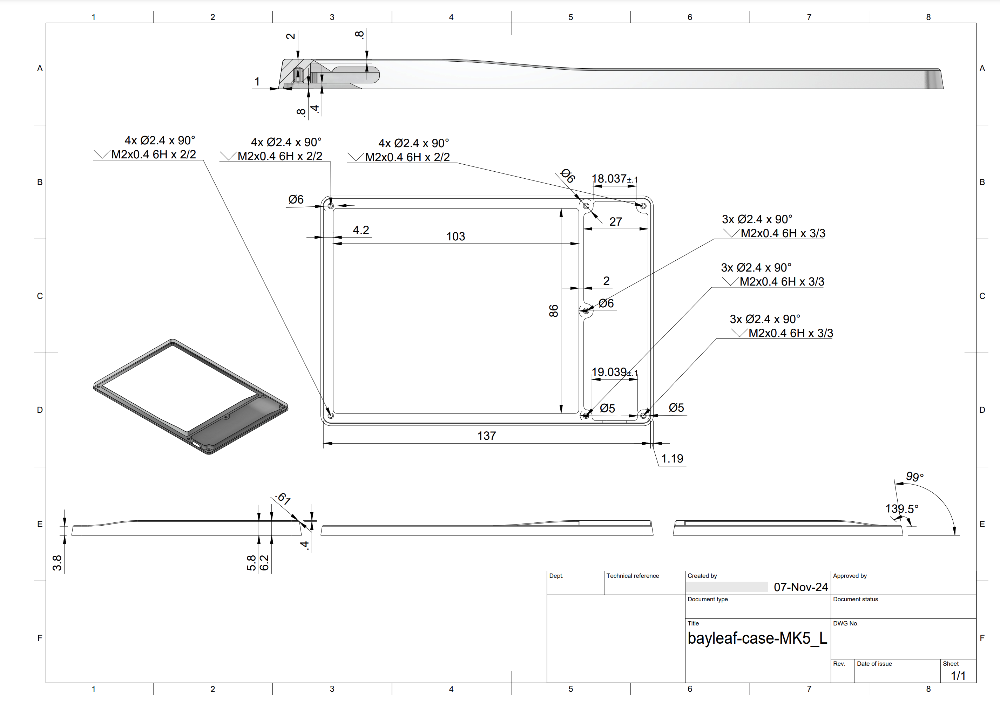

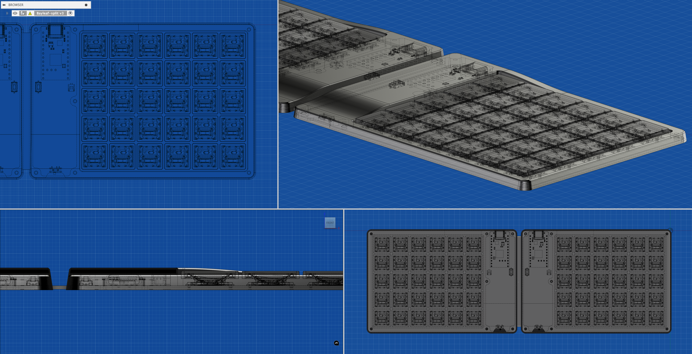

I started working on the custom keycaps pretty soon after I finished the build. The stock caps simply didn't cut it in terms of fit tolerances and sound profile. Some research led me to MJF/SLS printing which could handle the small tolerances I needed for the PG1316 switches.

At the time of writing the caps are still WIP as I'm testing lots of different fits and sizes. I don't own a 3D printer (yet) so I needed to design all variations in one go to save on manufacturing costs, yikes!

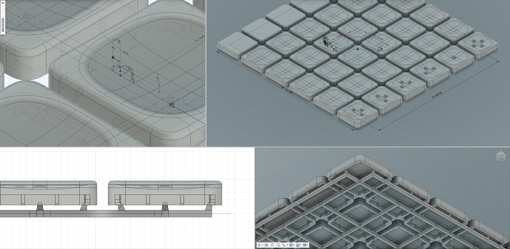

# Assembly

The kitchen became my workspace for the assembly. Production of regular carbonaras were seized. Production of keyboarnaras commenced. Now you know this wasn't written by AI.

Tool shoutout

- Bismuth based & lead-free low-temp solder paste
- Water soluble, no-clean flux
- Miniware 50x50mm hotplate
- Isopropyl alcohol for cleaning
- Standard soldering gear
- Multimeter

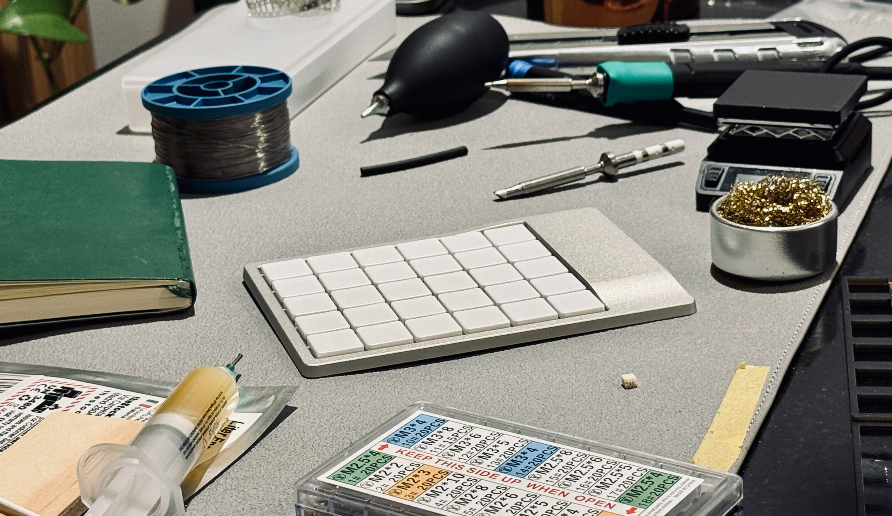

# Challenges

Two challenges stood out in the build process, soldering, and cleaning.

Hotplate soldering a 1 mm thick PCB board leads to warping. And bent surfaces are difficult to heat evenly. During each soldering attempt I had to monitor for: surface contact, reflow temperature, temperature buildup profile, not overcooking it, ensuring switch alignment, chasing solder balls with flux, all while not burning myself. My hands were full.

I ordered a massive SMD stencil in a frame which I didn't end up using because the switches required some serious baby-sitting to ensure good connection. I found the best method to prevent missoldered connections was to manually apply about 3x more paste than a stencil would.

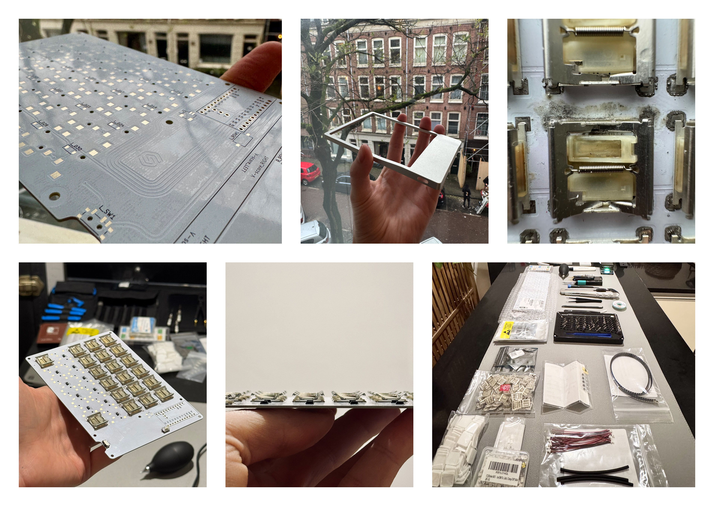
<aside>
  You can see on the 3rd image one of my first attempts at soldering with a hotplate. Took a few tries to get the hang
  of it.
</aside>

The second challenge was cleaning. The "no-clean" solder flux needed to be washed away to avoid it oxidizing. When the isopropyl alcohol didn't bite, I eventually found boiling hot water to wash away the flux residue. I should really start reading the specs.

The moisture sensitive bismuth solder was messy, leading to very tiny liquid solder balls flying everywhere during soldering. Even perfect solder connections needed to be manually brushed and cleaned.
It helped to solder the switches in groups of 4, clean after each round, and move onto the next.

Each 5x6 grid of switches took me a full day to solder. It was likely the least efficient manufacturing shop in the EU at one point.

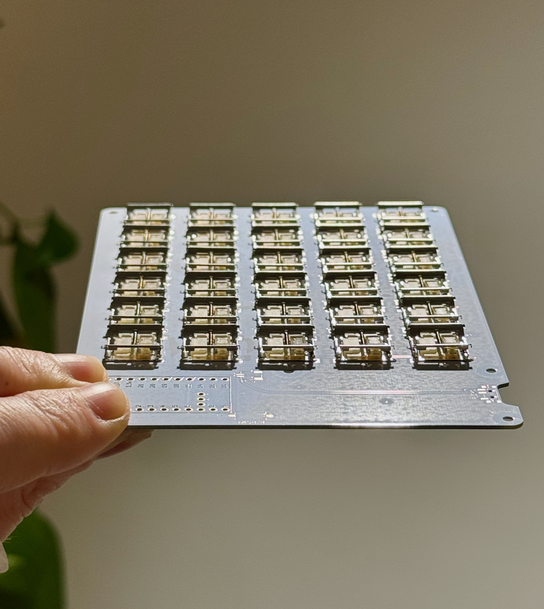
<aside>
  Almost finished right side. Notice the through-hole components for the MCU which is no bueno for a surface mount
  build. Oops!
</aside>

# Verdict

I mean its cool.

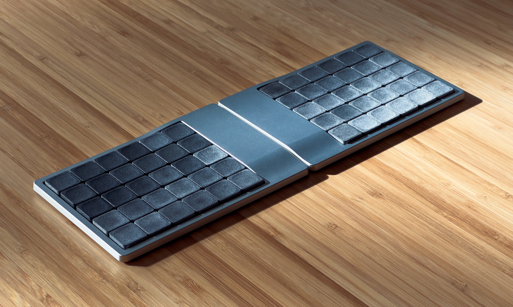

# Oopsies

- Not putting vias in the copper pads of the switches, this led to slightly colder connection between the hotplate and PCB.
- Using white solder mask for the PCB, oxidizes into a reddish color when overheated
- Forgetting to change the nice!nano PCB footprint to be surface mounted instead of through-hole. I had to put polyamide tape on the bottom and solder it by hand manually. This ended up being a nice fix which was suggested by Mike's friend Coen when we met, thank you!
- Physical reset button still needed due to ZMK, waking up sometimes requires resetting. Currently the physical reset button is hidden under the enclosure making it hard to reach. Only a problem if the battery is really low.
- Not pre-baking the boards prior to soldering, small bumps would appear on the PCB board during soldering from the trapped moisture
- Not putting more effort into acoustics and vibration mitigation. Small changes to the enclosure to better handle how sound travels during typing.

# Looking ahead

Here are some ideas for the next iteration.

- Improved thumb cluster
- More ergonomic design considerations
- Rethink stagger setup
- Physical reset button
- More personalization on the aluminum case
- Integrated PCB components to have more control over antenna placement
- Longer chassis side-skirts to allow ad-hoc post production solutions like adding additional foam layers to reduce vibrations and improve sound profile
- Enclose bottom of the chassis with material to prevent PCB from freely bending, further reducing vibration
- Magnet snapping for traveling
- Bigger enclosure border radii
- LED 1x3 array indicator to show layers and other commands
- Experiment with smaller switches like the PG1316M to find new interesting layouts
- Pointer devices and rotary encoders

# Socials

- [Twitter/X](https://x.com/grazsebastian)
- [Bluesky](https://bsky.app/profile/graz.io)
- <Link to="/">Portfolio</Link>
- <EmailLink string="hi@graz.io">
    <a>Email</a>
  </EmailLink>

# FAQ

<Faq>
  <Question title="Who are you?">
    <Answer>  
      I'm Sebastian, I make stuff. My serious grown-up job is running my own branding studio (this very website). My less serious job is creating fun products. Whether its tackling personal friction, or learning new skills. 
    </Answer>
  </Question>

<Question title="Can I buy this keyboard?">
  <Answer>Negative, this singular prototype if not for sale. But stay tuned for a future production run.</Answer>
</Question>

  <Question title="Is it open source?">
    <Answer>
      I havent decided on a license yet. And most of the source files are work in progress.
    </Answer>
  </Question>
</Faq>
