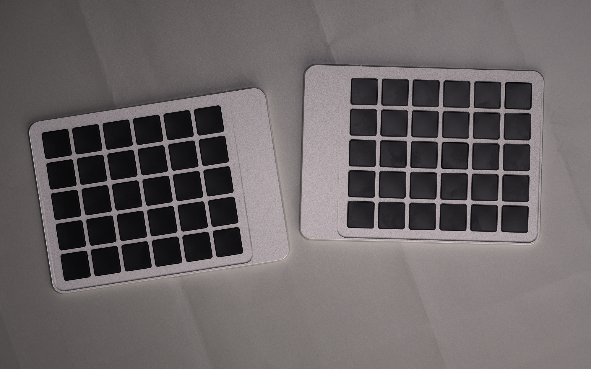
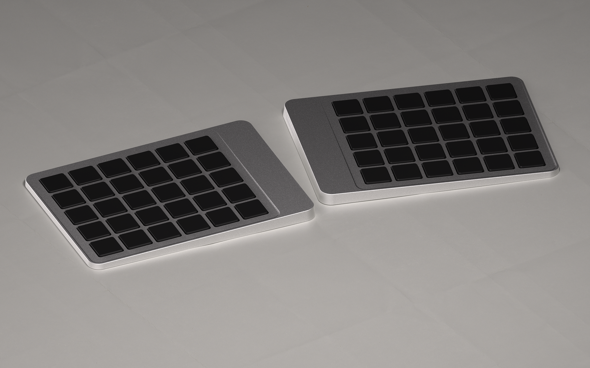
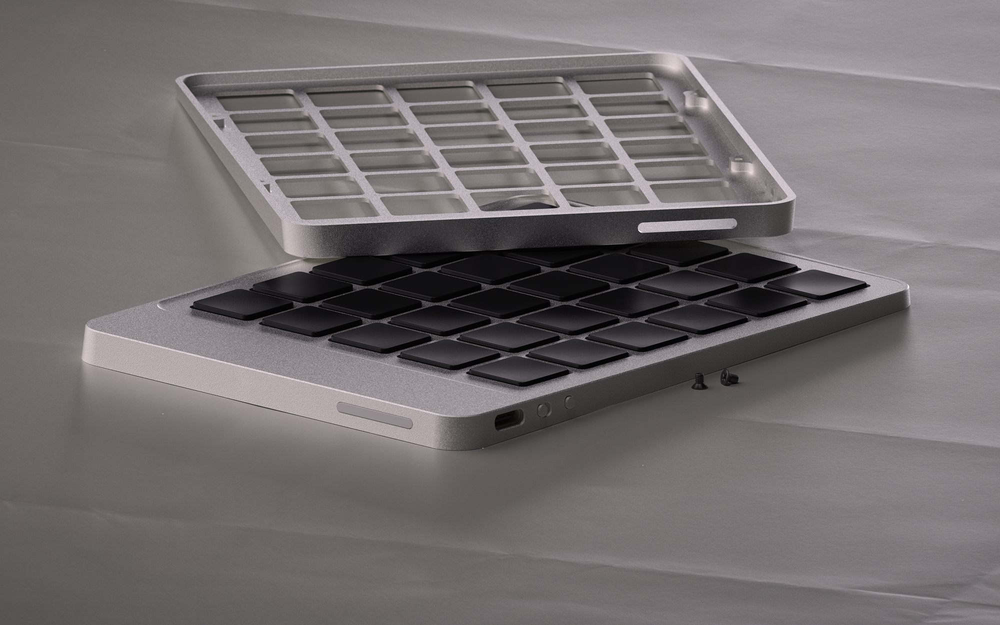
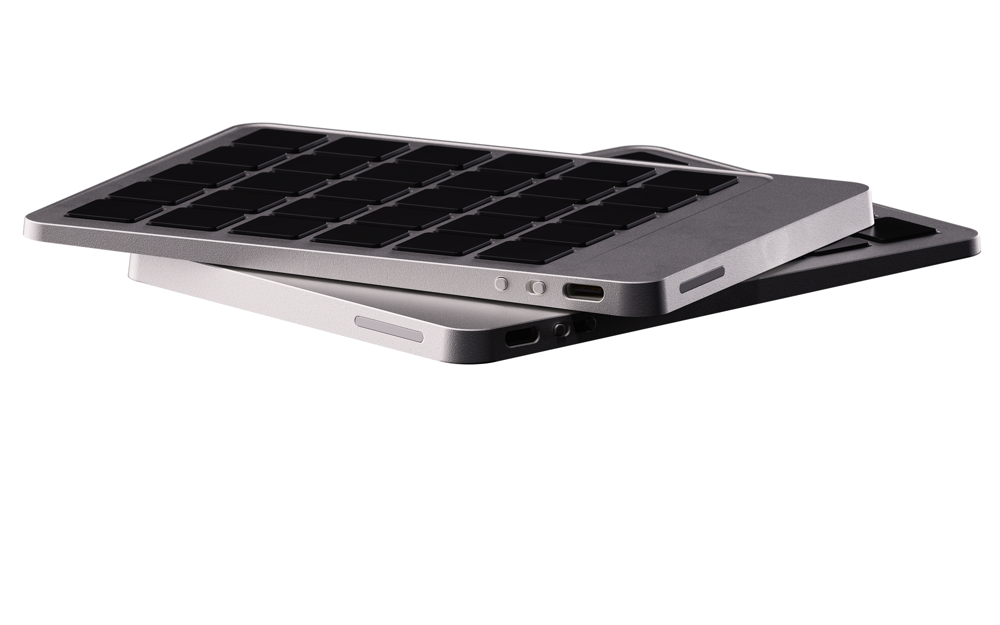

import { EmailLink } from "@/components/EmailLink/EmailLink";
import { Faq, Question, Answer } from "@/pages/articles/FAQ";
import { DefinitionTable } from "@/components/DefinitionTable/DefinitionTable";
import { Text } from "theme-ui";
import { Tooltip } from "@/components/Tooltip/Tooltip";
import { EmailSignup } from "@/components/EmailSignup/EmailSignup";

<DefinitionTable
  items={[
    { term: "Status", description: "Work in progress" },
    { term: "Type", description: "Wireless & split" },
    { term: "Layout", description: "60% · Ortholinear" },
    { term: "Switches", description: "Framework · OKM" },
  ]}
/>

# Figleaf, a work in progress.

Last year I built <Link to="/articles/bayleaf-wireless-keyboard">Bayleaf</Link>, a wireless ergonomic keyboard from scratch. A personal end-game typea thing, so naturally I'm building another one.

Meet Figleaf. It's not done yet, but the design is far enough along that I wanted to share where it's at. Proper build log will follow. Like its predecessor, Figleaf is also wireless, split, low-profile, CNC machined, and all those things. But with a big difference, it'll be using the new OKM switches from Framework. A rare and uncharted occasion to work with modular laptop-style switches. And so far they make the previous PG1316S switches sound like a hobby project. Needless to say, I'm excited about the potential.

Below are some work-in-progress renders of the keyboard. I'll be posting a new update after I've received the parts and have started the build.

# Next steps

- An overly friendly message to the machinist and manufacturer.
- Assembly, soldering, cursing.
- Keep you all posted.

<Background variant="dots">

<small>Stay in the loop for the the follow up!</small>

<EmailSignup placeholder="Enter your email" cta="Notify me" />

</Background>

# Socials

- [Twitter/X](https://x.com/grazsebastian)
- [Bluesky](https://bsky.app/profile/graz.io)
- <Link to="/">Portfolio</Link>
- <EmailLink string="hi@graz.io">
    <a>Email</a>
  </EmailLink>
