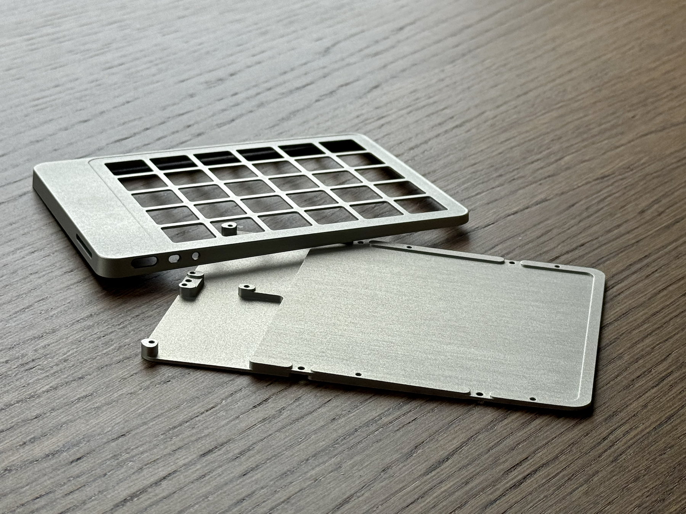
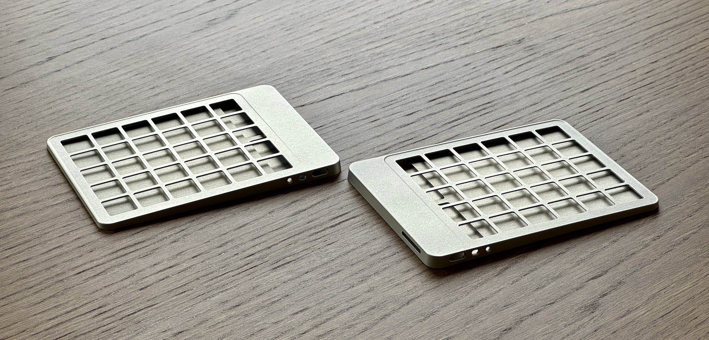
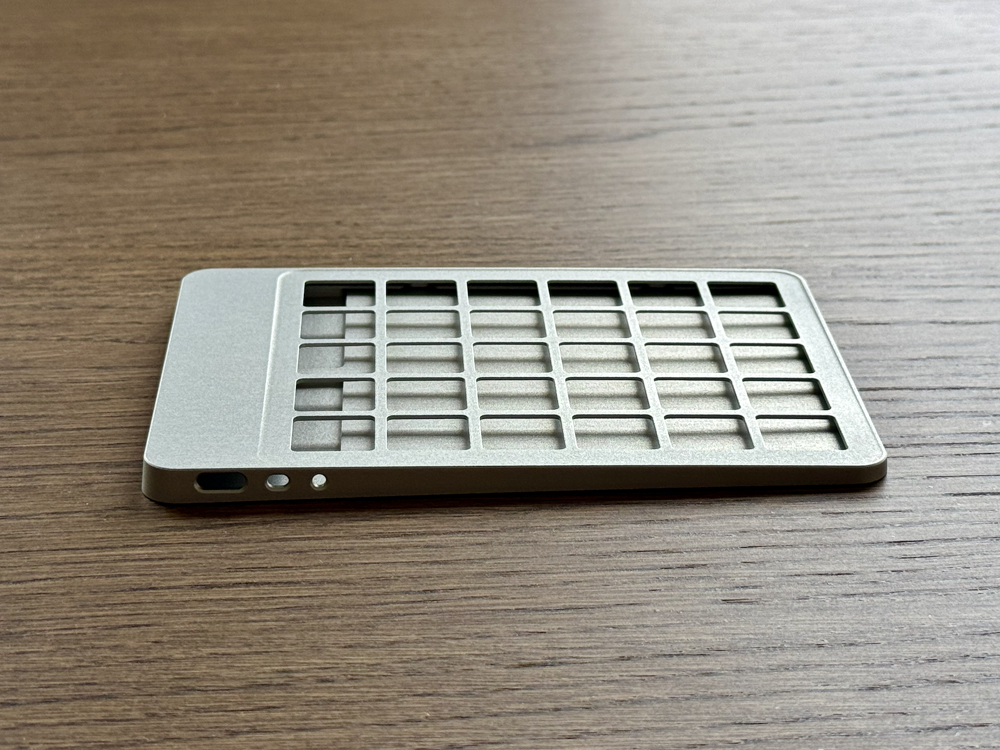
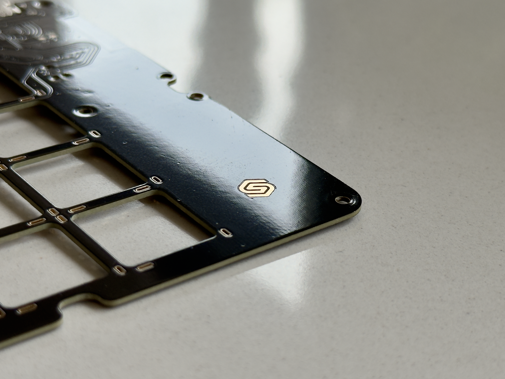
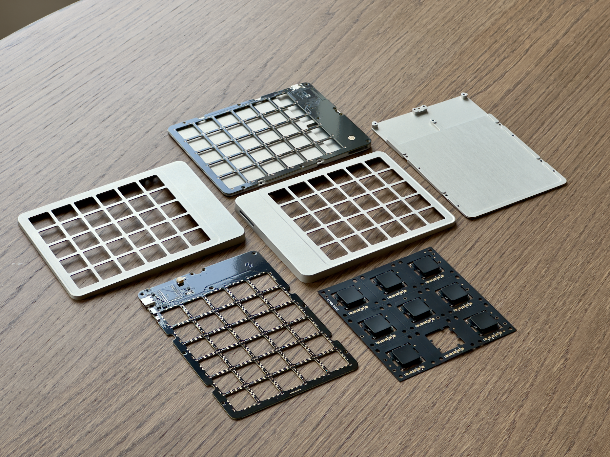

import { EmailLink } from "@/components/EmailLink/EmailLink";
import { Faq, Question, Answer } from "@/pages/articles/FAQ";
import { DefinitionTable } from "@/components/DefinitionTable/DefinitionTable";
import { Text } from "theme-ui";
import { Tooltip } from "@/components/Tooltip/Tooltip";
import { EmailSignup } from "@/components/EmailSignup/EmailSignup";
import { ImageRow } from "./ImageRow/ImageRow";
import { Box } from "theme-ui";
import hero from "./hero.avif";

<DefinitionTable
  items={[
    { term: "Status", description: "Work in progress" },
    { term: "Type", description: "Wireless & split" },
    { term: "Layout", description: "60% · Ortholinear" },
    { term: "Switches", description: "Framework · OKM" },
    { term: "Enclosure", description: "CNC machined · aluminum" },
    { term: "Dimensions", description: "W147 · L109 · H3.75/5" },
    { term: "Weight", description: "~210g" },
    { term: "Firmware", description: "ZMK Studio" },
  ]}
/>

<Background variant="grid">

# Figleaf, a work in progress.

Last year I built <mark><Link to="/articles/bayleaf-wireless-keyboard">Bayleaf</Link></mark>, a wireless ergonomic keyboard from scratch. A personal end-game, no-holds-barred, final boss kind of keyboard. So naturally here we are, a year later building another one.

Meet <mark>Figleaf</mark>. It's not done yet, but the <mark>V1</mark> is far enough along that I wanted to share where things stand. Proper build log will follow. Like its predecessor, Figleaf is also wireless, split, low-profile, CNC machined. But with one big change, it'll be using the new One Key Module switches from Framework, which I received as part of their developer program. Shout-out to Framework for sending these!

This is a rare and uncharted chance to work with modular laptop-style switches that are hobbyist-accessible. One that could solve my previous keyboard biggest flaw, the acoustics. The previous PG1316 switches were loud and harsh, but now we might have a suitable low-pro successor that can keep the peace in an office environment.

While I finalize the details, here are some 3D renders, photos of prototypes, and other goodies. Once everything's assembled and working, expect a follow-up post covering the raison d'être, revisions, the full build log, failures, future plans and more.

</Background>

# Wireframes & 3D Renders

Snapshots from various corners of the project. CAD, PCB work, assembly planning, and some renders to make sure it all looks dope before we start cutting into real metal.

<ImageRow gap="0">
  
  
  
</ImageRow>

<ImageRow>
  
  
  
  
</ImageRow>

<ImageRow>
  
  
  
</ImageRow>

<ImageRow>
  
</ImageRow>

# Hardware prototypes

Receiving real parts is an equal cocktail of dopamine and cortisol. Going from screen to tangible after months of planning makes my dopamine do enthusiastic backflips, but the stress of not being able to <mark>Ctrl-Z</mark> machined hardware is terrifying. Luckily this time everything fit together perfectly.

<aside>
  
V1.0 of the case prototype for the left side, divided into a fixture part and a top part

</aside>

<aside>
  
Top of the case is profiled to expose the thumb keys for better ergonomics.

</aside>

{/* prettier-ignore */}
<aside>
  
PCB detail. It's a happy coincidence that my old logo is so <mark>manufacturable</mark>.

</aside>

<aside>
  
The whole family, together. Including the new switches!

</aside>

Hope you enjoyed this early introduction to Figleaf. Next post we'll get into the nitty gritty of building this thing. And deep-dive into design decisions, compromises, constraints, and whether or not it turned out better than <mark><Link to="/articles/bayleaf-wireless-keyboard">Bayleaf</Link></mark> in terms of acoustics.

# Next steps

- Assembly
- Soldering
- Firmware
- Pleading it all works
- Keeping you all posted

<Background variant="dots">

<small>Stay in the loop for the the follow up!</small>

<EmailSignup placeholder="Enter your email" cta="Notify me" />

</Background>

# Socials

- [Twitter/X](https://x.com/grazsebastian)
- [Bluesky](https://bsky.app/profile/graz.io)
- <Link to="/">Portfolio</Link>
- <EmailLink string="hi@graz.io">
    <a>Email</a>
  </EmailLink>
