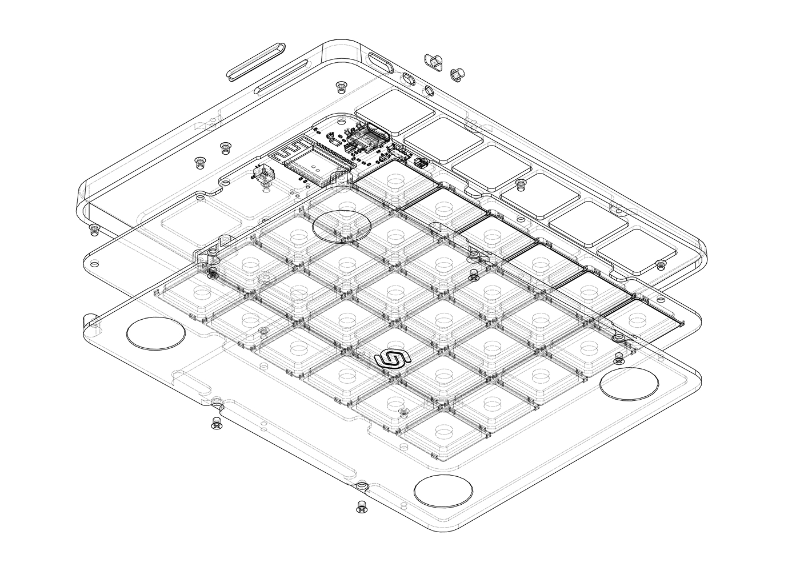
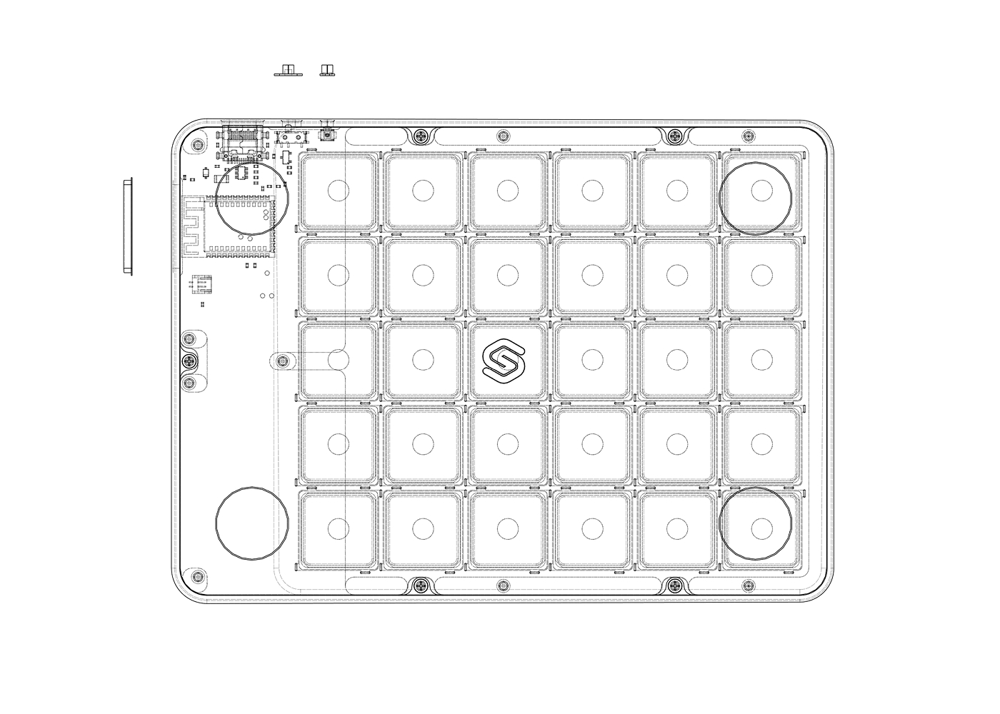
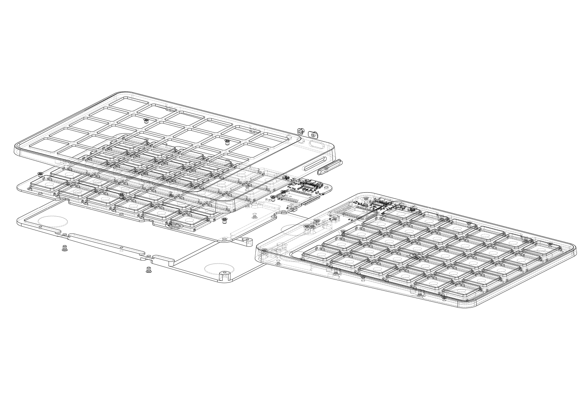
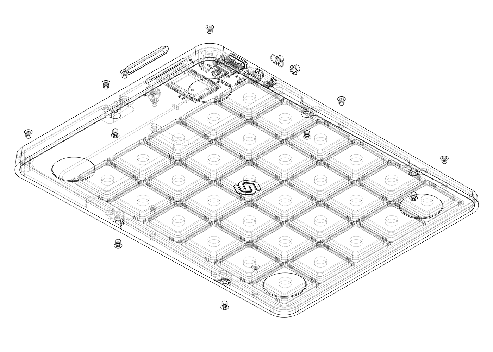
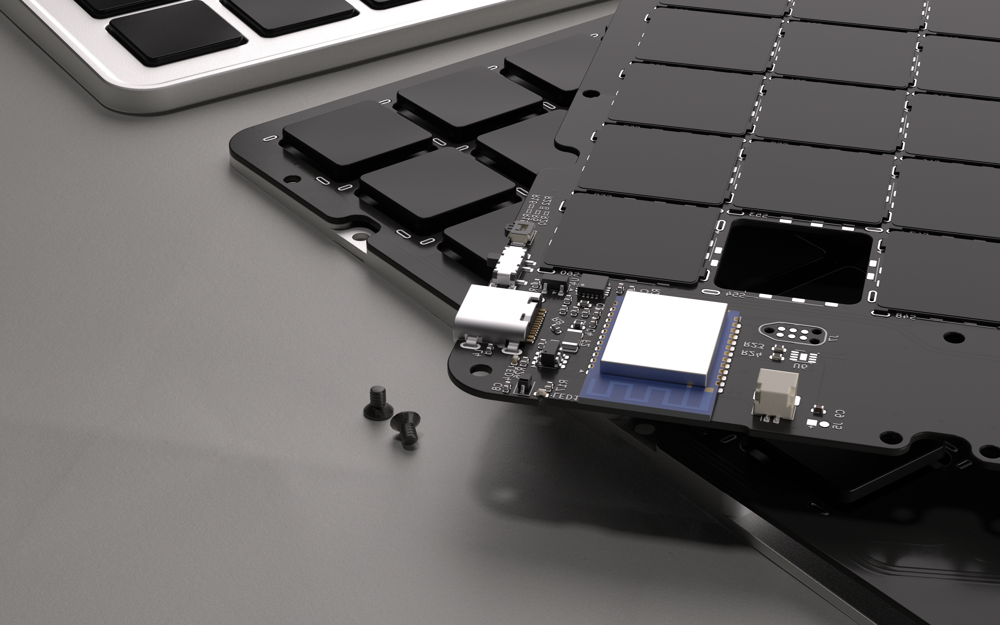
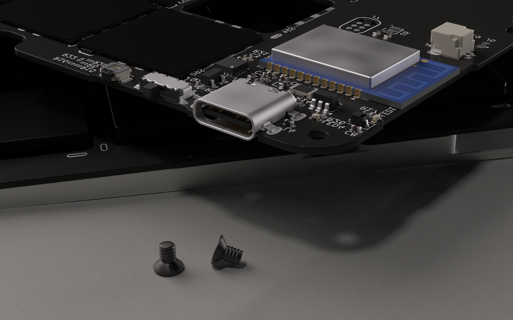
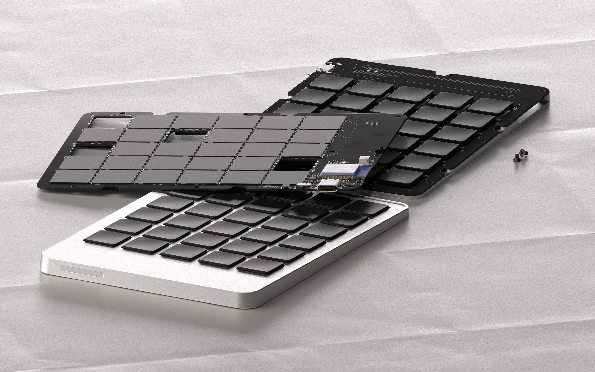
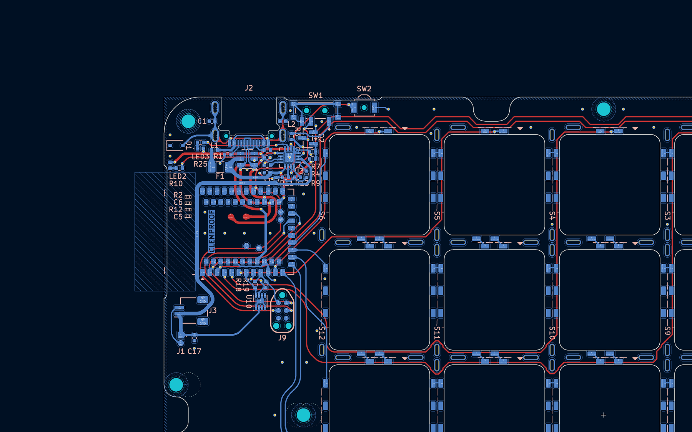

import { EmailLink } from "@/components/EmailLink/EmailLink";
import { Faq, Question, Answer } from "@/pages/articles/FAQ";
import { DefinitionTable } from "@/components/DefinitionTable/DefinitionTable";
import { Text } from "theme-ui";
import { Tooltip } from "@/components/Tooltip/Tooltip";
import { EmailSignup } from "@/components/EmailSignup/EmailSignup";
import { ImageRow } from "./ImageRow/ImageRow";
import { Box } from "theme-ui";

<DefinitionTable
  items={[
    { term: "Status", description: "Work in progress" },
    { term: "Type", description: "Wireless & split" },
    { term: "Layout", description: "60% · Ortholinear" },
    { term: "Switches", description: "Framework · OKM" },
  ]}
/>

<Background variant="grid">

# Figleaf, a work in progress.

Last year I built <mark><Link to="/articles/bayleaf-wireless-keyboard">Bayleaf</Link></mark>, a wireless ergonomic keyboard from scratch. A personal end-game, no-holds-barred, final boss kind of keyboard. So naturally here we are, a year later building another one.

Meet <mark>Figleaf</mark>. It's not done yet, but the design is far enough along that I wanted to share where things stand. Proper build log will follow. Like its predecessor, Figleaf is also wireless, split, low-profile, CNC machined. But with one big change, it'll be using the new One Key Module switches from Framework, which I received as part of their developer program.

This is a rare and uncharted chance to work with modular laptop-style switches that are hobbyist-accessible. One that could solve one of Bayleaf's biggest flaws: the acoustics. The previous PG1316 switches just didn't sound great, but now we might have a suitable low-pro successor that can keep the peace in an office environment.

While I finalize the details, here are some 3D renders based on the real CAD and PCB files. Expect a full update once everything's assembled.

</Background>

<ImageRow>
  
  
  
</ImageRow>

<ImageRow>
  
  
  
</ImageRow>

<aside>
  
Top of the case is machined to expose the thumb keys for better ergonomics.

</aside>

<aside>
  
Not a single screw visible once assembled. It's comprised of a fixture and a top plate.

</aside>

<aside>
  
Damn, forgot to fillet the column traces up top.

</aside>

Hope you enjoyed this early introduction to Figleaf. Next post we'll get into the nitty gritty of building & assembly. I can't wait to see what silly mistakes I made.

# Next steps

- An overly friendly message to the machinist and manufacturer.
- Assembly, soldering and some cursing.
- Keeping you all posted.

<Background variant="dots">

<small>Stay in the loop for the the follow up!</small>

<EmailSignup placeholder="Enter your email" cta="Notify me" />

</Background>

# Socials

- [Twitter/X](https://x.com/grazsebastian)
- [Bluesky](https://bsky.app/profile/graz.io)
- <Link to="/">Portfolio</Link>
- <EmailLink string="hi@graz.io">
    <a>Email</a>
  </EmailLink>
